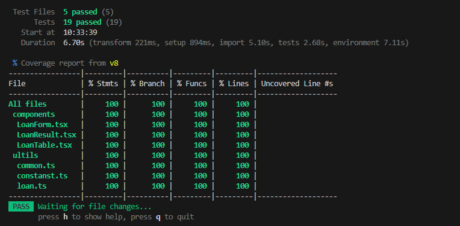
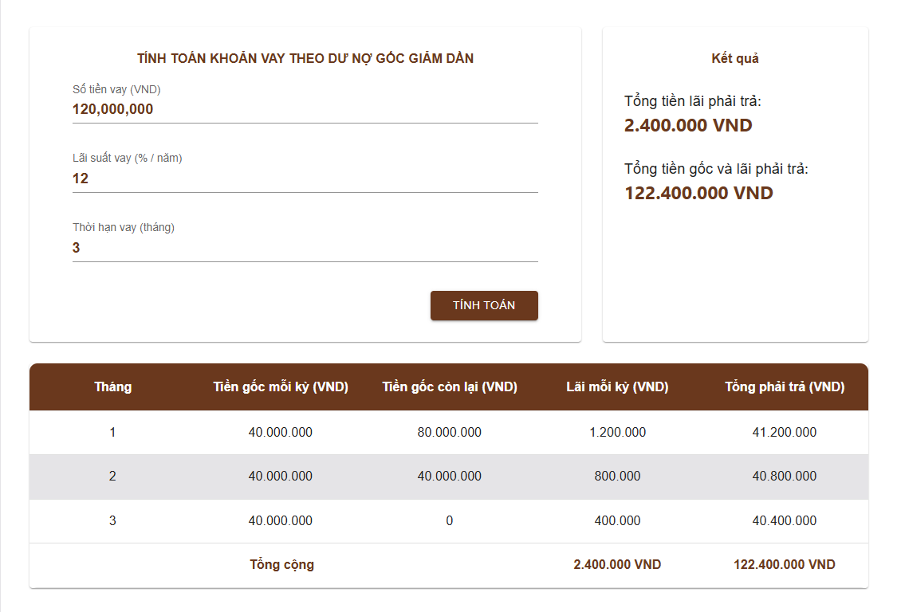

# Loan Calculator

Ứng dụng web đơn giản giúp người dùng **tính toán khoản vay** dựa trên dư nợ gốc giảm dần:

Người dùng nhập các trường trong Form
- Số tiền vay (VNĐ)
- Lãi suất vay (% / năm)
- Thời hạn vay (tháng)

Hệ thống sẽ tính toán và hiển thị **bảng số tiền cần trả theo tháng**, bao gồm:
- Tiền gốc phải trả
- Tiền lãi phải trả
- Tổng tiền thanh toán
- Dư nợ còn lại

---

# Công nghệ sử dụng
- React
- Vite
- TypeScript
- Material UI (MUI)
- React Hook Form
- Zod 
- BigNumber.js
- React Number Format
- Vitest (unit test)

---

# Cài đặt
### clone
```
git clone https://github.com/minhtq3120/test-lpbs.git
cd loan-calculator
```

### install dependencies
```
yarn
```

### run project
```
yarn dev
```

### run unit tests
```
yarn test
yarn test:coverage
```




# Demo
[https://test-lpbs.vercel.app/](https://test-lpbs.vercel.app/)


